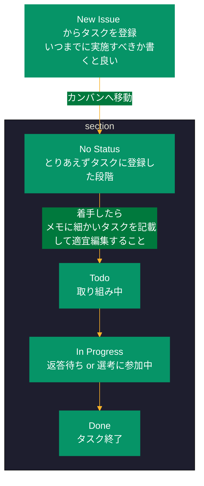

```mermaid
%%{
  init: {
    'theme': 'base',
    'themeVariables': {
      'primaryColor': '#069467',
      'primaryTextColor': '#fff',
      'primaryBorderColor': '#069467',
      'lineColor': '#F8B229',
      'secondaryColor': '#00793D',
      'tertiaryColor': '#1E1E2E'
    }
  }
}%%
        graph TD
          A[New Issue <br/>からタスクを登録</br>いつまでに実施すべきか書くと良い] -->|カンバンへ移動| B[No Status</br>とりあえずタスクに登録した段階]
          B --> |着手したら</br> メモに細かいタスクを記載して適宜編集すること| C[Todo <br/> 取り組み中]
          C --> D[ In Progress</br>返答待ち or 選考に参加中]
          D --> E[Done</br>タスク終了]
          
          subgraph section
            B
            C
            D
            E
          end
```