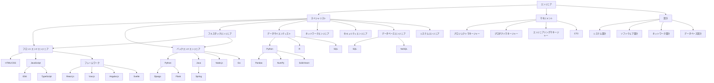

# エンジニアキャリア

```mermaid
graph TB
A[エンジニア] --> B[スペシャリスト]
B --> B1[フロントエンドエンジニア]
B1 --> B1a[HTML/CSS]
B1 --> B1b[JavaScript]
B1b --> B1b1[ES6]
B1b --> B1b2[TypeScript]
B1 --> B1c[フレームワーク]
B1c --> B1c1[React.js]
B1c --> B1c2[Vue.js]
B1c --> B1c3[Angular.js]
B1c --> B1c4[Svelte]
B --> B2[バックエンドエンジニア]
B2 --> B2a[Python]
B2a --> B2a1[Django]
B2a --> B2a2[Flask]
B2 --> B2b[Java]
B2b --> B2b1[Spring]
B2 --> B2c[Node.js]
B2 --> B2d[Go]
B --> B3[フルスタックエンジニア]
B3 --> B1
B3 --> B2
B --> B4[データサイエンティスト]
B4 --> B4a[Python]
B4a --> B4a1[Pandas]
B4a --> B4a2[NumPy]
B4a --> B4a3[Scikit-learn]
B4 --> B4b[R]
B4 --> B4c[SQL]
B --> B5[ネットワークエンジニア]
B --> B6[セキュリティエンジニア]
B --> B7[データベースエンジニア]
B7 --> B7a[SQL]
B7 --> B7b[NoSQL]
B --> B8[システムエンジニア]
A --> C[マネジメント]
C --> C1[プロジェクトマネージャー]
C --> C2[プロダクトマネージャー]
C --> C3[エンジニアリングマネージャー]
C --> C4[CTO]
A --> D[設計]
D --> D1[システム設計]
D --> D2[ソフトウェア設計]
D --> D3[ネットワーク設計]
D --> D4[データベース設計]

```
