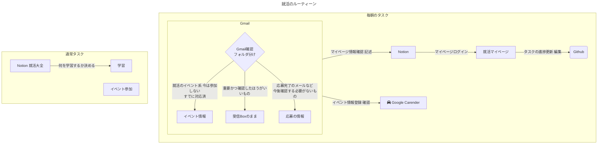

```mermaid
---
title: 就活のルーティーン
---
graph TD
          Z[イベント情報]
		  X[応募の情報]
		  Y[受信Boxのまま]

		  A{Gmail確認<br/>フォルダ分け}
          B(Github)
          C[Notion]
          D[fa:fa-car Google Carender]
          E[就活マイページ]
		F[Notion 就活大全]
		G[イベント参加]
		H[学習]

		subgraph P[毎朝のタスク]
			subgraph O[Gmail]
				A --> |重要かつ確認したほうがいいもの|Y
				A --> |応募完了のメールなど<br/>今後確認する必要がないもの|X
				A --> |就活のイベント系 今は参加しない<br/>すでに対応済|Z
			end
		        O -->|マイページ情報確認 記述|C
						C --> |マイページログイン|E
	          E --> |タスクの進捗更新 編集|B
	          O -->|イベント情報登録 確認|D
					end
					subgraph 通常タスク
						F -->|何を学習するか決める|H
						G
					end
```
