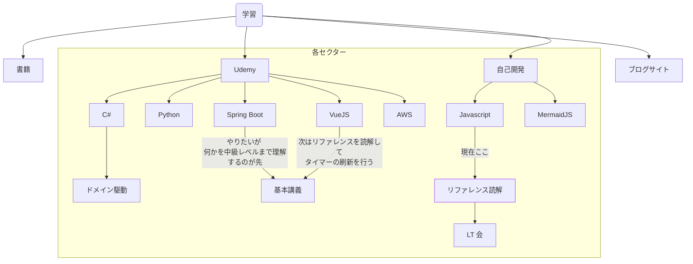

```mermaid
graph TB
classDef Purple fill:,stroke:#A533FF
H1-1(学習)
H2-1[書籍]
H2-2[Udemy]
H2-3[ブログサイト]
H2-4[自己開発]
H3-1[C#]
H3-2[Python]
H3-3[Spring Boot]
H3-4[Javascript]
H3-5[VueJS]
H3-6[MermaidJS]
H3-7[AWS]
H4-1[リファレンス読解]:::Purple
H4-2[ドメイン駆動]
H4-3[基本講義]
H5-1[LT 会]

H1-1-->H2-1
H1-1-->H2-2
H1-1-->H2-3
H1-1-->H2-4

subgraph 各セクター
H2-2-->H3-1-->H4-2
H2-2-->H3-2
H2-2-->H3-3-->|やりたいが <br/>何かを中級レベルまで理解するのが先|H4-3
H2-2-->H3-5-->|次はリファレンスを読解して<br/>タイマーの刷新を行う|H4-3
H2-2-->H3-7

        H2-4-->H3-4-->|現在ここ|H4-1-->H5-1
    H2-4-->H3-6

end
```
