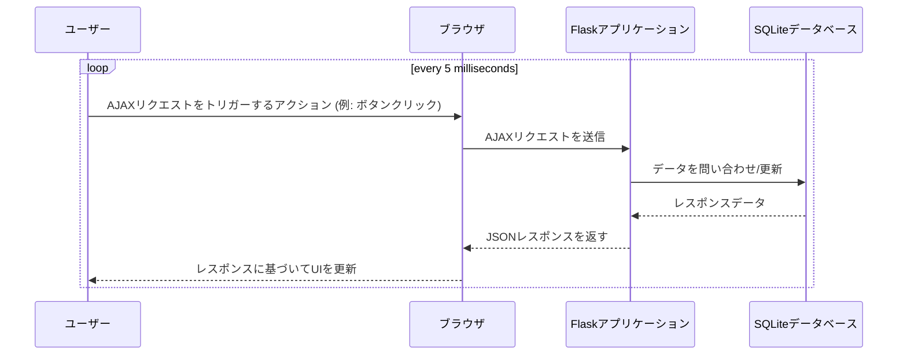

# Python ChatApp HttpRequest

```mermaid
sequenceDiagram
    participant User as ユーザー
    participant Browser as ブラウザ
    participant FlaskApp as Flaskアプリケーション
    participant SQLite as SQLiteデータベース

    loop every 5 milliseconds
        User->>Browser: AJAXリクエストをトリガーするアクション (例: ボタンクリック)
        Browser->>FlaskApp: AJAXリクエストを送信
        FlaskApp->>SQLite: データを問い合わせ/更新
        SQLite-->>FlaskApp: レスポンスデータ
        FlaskApp-->>Browser: JSONレスポンスを返す
        Browser-->>User: レスポンスに基づいてUIを更新
    end
```

